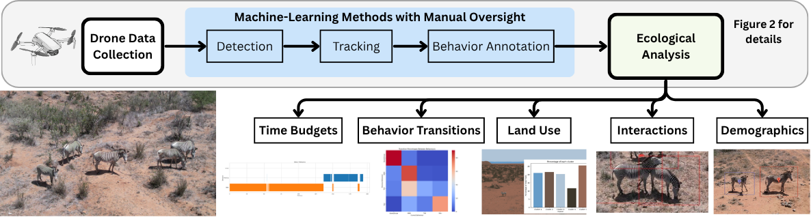
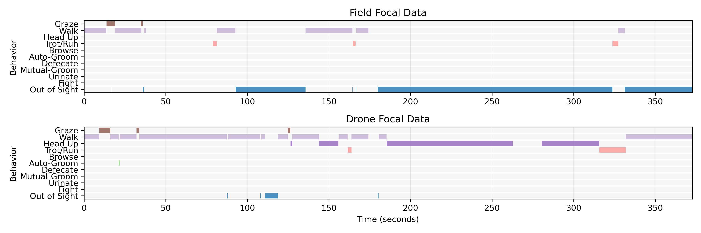

# kabr-tools  [](https://zenodo.org/doi/10.5281/zenodo.11288083)

#### This repository contains tools to perform animal behavioral analysis from drone videos.

The modular pipeline processes drone video through object detection, individual tracking, and machine learning-based behavioral classification to generate ecological metrics including time budgets, behavioral transitions, land use and habitat, social interactions, and demographic data. Framework design enables integration of novel ML models and adaptation across species and study systems.

<details>
  <summary>Click to expand detailed description</summary>

Understanding community-level ecological patterns requires scalable methods to process multi-dimensional behavioral data. Traditional field observations are limited in scope, making it difficult to assess behavioral responses across landscapes. To address this, we present Kenyan Animal Behavior Recognition, kabr-tools. This open-source computational ecology framework integrates drone-based video with machine learning to automatically extract behavioral, social, and spatial metrics from wildlife footage.

Our pipeline processes multi-species drone data using object detection, tracking, and behavioral classification to generate five key metrics: time budgets, behavioral transitions, social interactions, habitat associations, and group composition dynamics. Validated on three African species, our system achieved 65 - 70% behavioral classification accuracy, with >95%.

</details>


## Overview


**Figure 1:** kabr-tools computational framework for automated wildlife behavioral monitoring. 

### 🔧 Installation

`kabr-tools` requires **Python 3.10 or 3.11**.

### Basic installation

```bash
pip install -e .
```

### Optional installation modes

- Behavior classification with SlowFast:
  ```bash
  pip install -e ".[slowfast]"
  ```

- Development tools:
  ```bash
  pip install -e ".[dev]"
  ```

- Documentation tools:
  ```bash
  pip install -e ".[docs]"
  ```

- All-in-one (recommended for contributors):
  ```bash
  pip install -e ".[slowfast,dev,docs]"
  ```

> Note: For CUDA-specific `torch` versions, refer to [pytorch.org](https://pytorch.org/get-started/locally/).

## 📖 Project Overview

The KABR tools pipeline consists of:

1. **Drone-based video collection**
2. **Annotation and tracking using CVAT**
3. **Mini-scene extraction**
4. **Behavior classification**
5. **Ecological analysis**

Each script can be run via command-line (`<tool-name> -h`) or imported as a module.

## Documentation

- [User Guide](docs/pipeline.md)
- [Worked Example](docs/worked_example.md)
- [CVAT User Guide](https://github.com/Imageomics/kabr-tools/wiki/CVAT-User-Guide)
- [Data Management Tips](https://github.com/Imageomics/kabr-tools/wiki/Data-Management-Tips)

## Methodology Comparison and Case Studies

####  See [docs/methodology_comparison.md](docs/methodology_comparison.md) for a detailed comparison of different methods for animal behavior analysis, including:
- Focal sampling
- Scan sampling
- Drone-based video analysis

#### See [docs/case_studies.md](docs/case_studies.md) for case studies demonstrating the application of kabr-tools in various ecological contexts, including:
- Grevy's zebra time budgets
- Mixed-species social interactions

#### Example time budget analysis output comparing behavior granularity collected from drone videos versus traditional field observations.


**Figure 2:** Time budget comparison between drone-based behavior classification (bottom) and manual field focal observations (top). 

## Related Papers
Please refer to our papers for details on the data collection process and machine learning model development.

- [KABR: In-Situ Dataset for Kenyan Animal Behavior Recognition](https://openaccess.thecvf.com/content/WACV2024W/CV4Smalls/papers/Kholiavchenko_KABR_In-Situ_Dataset_for_Kenyan_Animal_Behavior_Recognition_From_Drone_WACVW_2024_paper.pdf) 
- [Deep dive into KABR: a dataset for understanding ungulate behavior from in-situ drone video](https://link.springer.com/article/10.1007/s11042-024-20512-4) 
- [Integrating Biological Data into Autonomous Remote Sensing Systems for In Situ Imageomics: A Case Study for Kenyan Animal Behavior Sensing with Unmanned Aerial Vehicles (UAVs)](https://arxiv.org/abs/2407.16864)

## Citation

If you use this toolkit in your research, please cite:

```bibtex
@software{kabr-tools,
  author = {Kline, Jenna and Zhong, Alison and Campolongo, Elizabeth and Kholiavchenko, Maksim},
  title = {kabr-tools: Tools for annotating animal behavior in drone videos},
  version = {3.0.0},
  year = {2024},
  doi = {10.5281/zenodo.11288083},
  url = {https://github.com/Imageomics/kabr-tools}
}
```

## 💬 Feedback & Issues

Open issues on [GitHub](https://github.com/Imageomics/kabr-tools/issues).

## 🔗 License

This project is licensed under the [MIT License](LICENSE).


