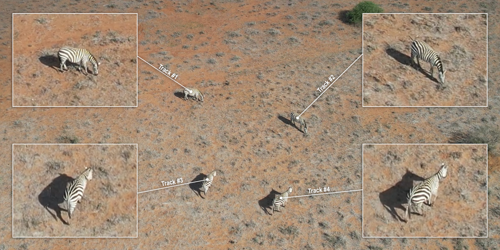

# kabr-tools  [](https://zenodo.org/doi/10.5281/zenodo.11288083)

<!-- TO DO: add new DOI -->


#### This repository contains tools to calculate time budget analysis  from drone videos of zebras and giraffes, using the [KABR model](https://huggingface.co/imageomics/x3d-kabr-kinetics) to automatically label behavior.


**Figure 1:** Overview of the pipeline for KABR dataset preparation.

The KABR tools used in this process can be installed with:
```
pip install git+https://github.com/Imageomics/kabr-tools
```

**Notes:**
 - detectron2 requires Linux or MacOS.
 - If `ModuleNotFoundError: No module named 'torch'` appears, try `pip install torch torchvision` in your environment and try installing `kabr_tools` again.
 - If building detectron2's wheel fails, check gcc & g++ ≥ 5.4.
 - SlowFast's setup.py is outdated; our workaround is `pip install git+https://github.com/Imageomics/SlowFast@797a6f3ae81c49019d006296f1e0f84f431dc356`, which is included when installing `kabr_tools`.

Each KABR tool can be run through the command line (as described below) or imported as a python module. They each have help information which can be accessed on the command line through `<tool-name> -h`.

Please refer to our [KABR Project Page](https://kabrdata.xyz/) for additional details.


## Step 1: Video Data Collection with Drones


**Figure 2:** Clip of drone video containing Plains and Grevy's zebras, plus some impalas.

The drone videos for the [KABR dataset](https://huggingface.co/datasets/imageomics/KABR) were collected at the Mpala Research Centre in January 2023. The missions were flown manually, using a DJI 2S Air drone. 

We collaborated with expert ecologists to ensure the disturbance to the animals was minimal. We launched the drone approximately 200 meters horizontal distance from the animals and an altitude of 30 meters. We gradually approached the herd from the side by reducing the altitude and horizontal distance, monitoring the animals for signs of vigilance.

Note, the vigilance exhibited by wildlife varies widely by species, habitat, sex, and the level to which animals may be habituated to anthropogenic noise. Therefore, we recommend tailoring your approach to your particular species and setting.

Please refer to our papers for details on the data collection process:
- [KABR: In-Situ Dataset for Kenyan Animal Behavior
Recognition from Drone Videos](https://openaccess.thecvf.com/content/WACV2024W/CV4Smalls/papers/Kholiavchenko_KABR_In-Situ_Dataset_for_Kenyan_Animal_Behavior_Recognition_From_Drone_WACVW_2024_paper.pdf)
- [A Framework for Autonomic Computing for In Situ Imageomics](https://ieeexplore.ieee.org/abstract/document/10336017)
- [Integrating Biological Data into Autonomous Remote Sensing Systems for In Situ Imageomics: A Case Study for Kenyan Animal Behavior Sensing with Unmanned Aerial Vehicles (UAVs)
](https://arxiv.org/abs/2407.16864)


## Step 2: Data Pre-processing with CVAT

In order to automatically label the animal videos with behavior, we must first create *mini-scenes* of each individual animal captured in the frame, illustrated below.


**Figure 3:** A mini-scene is a sub-image cropped from the drone video footage centered on and surrounding a single animal. Mini-scenes simulate the camera as well-aligned with each individual animal in
the frame, compensating for the movement of the drone and ignoring everything in the large field of
view but the animal’s immediate surroundings. The KABR dataset consists of mini-scenes and their
frame-by-frame behavior annotation.

#### To create mini-scenes, we first must perform the detection step, by drawing bounding boxes around each animal in frame. 

See [data/mini_scenes](https://huggingface.co/imageomics/x3d-kabr-kinetics/tree/main/data/mini_scenes) in HuggingFace for example mini-scenes.

### Step 2A: Perform detections to create tracks
#### Option 1: Manual detections in CVAT

**Figure 4:** Simplified CVAT annotation tool interface
<br>
Upload your raw videos to [CVAT](https://www.cvat.ai/) and perform the detections by drawing bounding boxes manually. This can be quite consuming, but has the advantage of generating highly accurate tracks. 
Depending on the resolution of your raw video, you may encounter out of space issues with CVAT. You can use [helper_scripts/downgrade.sh](helper_scripts/downgrade.sh) to reduce the size of your videos. 


#### Option 2: Automatic detections with YOLO
You may use [YOLO](https://docs.ultralytics.com/) to automatically perform detection on your videos. Use the script below to convert YOLO detections to CVAT format.


[detector2cvat:](src/kabr_tools/detector2cvat.py)
Detect objects with Ultralytics YOLO detections, apply SORT tracking and convert tracks to CVAT format.

```
detector2cvat --video path_to_videos --save path_to_save
```


### Step 2B: Create mini-scenes from tracks

Once you have your tracks generated, use them to create mini-scenes from your raw footage.

**tracks_extractor:** Extract mini-scenes from CVAT tracks.

```
tracks_extractor --video path_to_videos --annotation path_to_annotations [--tracking] [--imshow]
```

## Step 3: Label mini-scenes with behavior 
You can use the [KABR model](https://huggingface.co/imageomics/x3d-kabr-kinetics) to label the mini-scenes with behavior. See the [ethogram](ethogram) folder for the list of behaviors used to label the zebra videos.


To use the [KABR model](https://huggingface.co/imageomics/x3d-kabr-kinetics), download `checkpoint_epoch_00075.pyth.zip`, unzip `checkpoint_epoch_00075.pyth`, and install [SlowFast](https://github.com/facebookresearch/SlowFast). Then run [miniscene2behavior.py](miniscene2behavior.py).

Label the mini-scenes:
```
miniscene2behavior [--config path_to_config] --checkpoint path_to_checkpoint [--gpu_num number_of_gpus] --miniscene path_to_miniscene [--output path_to_output_csv]
```

**Notes:**
 - If the config hasn't been extracted yet, the script will write it to `config`. 
 - `checkpoint` should be the path to `checkpoint_epoch_00075.pyth`. 
 - If `gpu_num` is 0, the model will use CPU. Using at least 1 GPU greatly increases inference speed. If you're using OSC, you can request a node with one GPU by running `sbatch -N 1 --gpus-per-node 1 -A [account] --time=[minutes] [bash script]`.
 - mini-scenes are clipped videos focused on individual animals and video is the raw video file from which mini-scenes have been extracted.

See [these csv files](https://huggingface.co/imageomics/x3d-kabr-kinetics/tree/main/data/mini_scene_behavior_annotations) in HuggingFace for examples of annotated mini-scene outputs.


## Step 4: Calculate time budgets

See [time budgets example](/examples/time_budget.ipynb) to code to create these visualizations.


<!-- Add two photos side by side -->
<div style="display: flex; justify-content: space-between;">
  
  
</div>
<br>

**Figure 5:** Example flight path and video clip from KABR datasetL, 2 male Grevy's zebras observed for 10 minutes on 01/18/23.


<br>

**Figure 6:** Overall time budget for duration of 10 minute observation


<br>


**Figure 7:** Gantt chart for each zebra (3 minute duration)


## Optional Steps: 

### Fine-tune YOLO for your dataset
If you wish to use YOLO to automatically generate detections, you may want to fine-tune your YOLO model for your dataset using the [train_yolo notebook](examples/train_yolo.ipynb).


[cvat2ultralytics:](src/kabr_tools/cvat2ultralytics.py) Convert CVAT annotations to Ultralytics YOLO dataset.

```
cvat2ultralytics --video path_to_videos --annotation path_to_annotations --dataset dataset_name [--skip skip_frames]
```

<!-- 
Not sure what these scripts are for, Maksim you can provide info here?
-->

###  Extras

[player:](src/kabr_tools/player.py) Player for tracking and behavior observation.

```
player --folder path_to_folder [--save]
```


**Figure 7:** Example player.py output.

[cvat2slowfast:](src/kabr_tools/cvat2slowfast.py) Convert CVAT annotations to the dataset in Charades format.


```
cvat2slowfast --miniscene path_to_mini_scenes --dataset dataset_name --classes path_to_classes_json [--old2new path_to_old2new_json]
```

