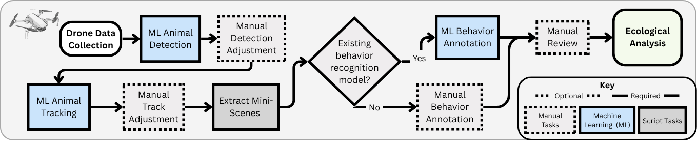

# Instructions for Processing Drone Videos with KABR Tools


**Figure 1:** KABR tools pipeline for processing drone videos. The pipeline consists of four main steps: video data collection, data pre-processing, behavior labeling, and ecological analysis. Each step is modular and can be adapted to different species and study systems.


## Step 1: Video Data Collection with Drones


**Figure 2:** Clip of drone video containing Plains and Grevy's zebras, and impalas.

The drone videos for the [KABR dataset](https://huggingface.co/datasets/imageomics/KABR) were collected at the Mpala Research Centre in January 2023. The missions were flown manually, using a DJI 2S Air drone. 

We collaborated with expert ecologists to ensure minimal disturbance to the animals. We launched the drone approximately 200 meters horizontally from the animals and at an altitude of 30-40 meters. We gradually approached the herd from the side by reducing the altitude and horizontal distance and monitoring the animals for signs of vigilance.

Note that the vigilance exhibited by wildlife varies widely by species, habitat, sex, and the level to which animals may be habituated to anthropogenic noise. So, we recommend that you tailor your approach to your particular species and setting.

Please refer to our papers for details on the data collection process:
- [KABR: In-Situ Dataset for Kenyan Animal Behavior
Recognition from Drone Videos](https://openaccess.thecvf.com/content/WACV2024W/CV4Smalls/papers/Kholiavchenko_KABR_In-Situ_Dataset_for_Kenyan_Animal_Behavior_Recognition_From_Drone_WACVW_2024_paper.pdf)
- [A Framework for Autonomic Computing for In Situ Imageomics](https://ieeexplore.ieee.org/abstract/document/10336017)
- [Integrating Biological Data into Autonomous Remote Sensing Systems for In Situ Imageomics: A Case Study for Kenyan Animal Behavior Sensing with Unmanned Aerial Vehicles (UAVs)
](https://arxiv.org/abs/2407.16864)


## Step 2: Data Pre-processing with CVAT

In order to automatically label the animal videos with behavior, we must first create *mini-scenes* of each individual animal captured in the frame, illustrated below.

See the Wiki [CVAT User Guide](https://github.com/Imageomics/kabr-tools/wiki/CVAT-User-Guide) and [Data Management Tips](https://github.com/Imageomics/kabr-tools/wiki/Data-Management-Tips) for detailed instructions and recommendations.


**Figure 4:** A mini-scene is a sub-image cropped from the drone video footage centered on and surrounding a single animal. Mini-scenes simulate the camera as well-aligned with each animal in
the frame, compensating for the drone's movement by focusing on just the animal and its immediate surroundings. The KABR dataset consists of mini-scenes and their
frame-by-frame behavior annotation.

#### To create mini-scenes, we first must perform the detection step, by drawing bounding boxes around each animal in frame. 

See [data/mini_scenes](https://huggingface.co/imageomics/x3d-kabr-kinetics/tree/main/data/mini_scenes) on Hugging Face for example mini-scenes.

### Step 2A: Perform detections to create tracks
#### Option 1: Manual detections in CVAT

**Figure 4:** Simplified CVAT annotation tool interface
<br>

Upload your raw videos to [CVAT](https://www.cvat.ai/) and perform the detections by drawing bounding boxes manually. This can be quite consuming, but has the advantage of generating highly accurate tracks. 
Depending on the resolution of your raw video, you may encounter out of space issues with CVAT. You can use [downgrade.sh](helper_scripts/downgrade.sh) to reduce the size of your videos. 


#### Option 2: Automatic detections with YOLO
You may use [YOLO](https://docs.ultralytics.com/) to automatically perform detection on your videos. Use the script below to convert YOLO detections to CVAT format.


[detector2cvat:](src/kabr_tools/detector2cvat.py)
Detect objects with Ultralytics YOLO detections, apply SORT tracking and convert tracks to CVAT format.

```
detector2cvat --video path_to_videos --save path_to_save [--imshow]
```


### Step 2B: Create mini-scenes from tracks

Once you have your tracks generated, use them to create mini-scenes from your raw footage.

**tracks_extractor:** Extract mini-scenes from CVAT tracks.

```
tracks_extractor --video path_to_videos --annotation path_to_annotations [--tracking] [--imshow]
```

## Step 3: Label mini-scenes with behavior 
You can use the [KABR model](https://huggingface.co/imageomics/x3d-kabr-kinetics) on Hugging Face to label the mini-scenes with behavior. See the [ethogram](ethogram) folder for the list of behaviors used to label the zebra videos.


Label the mini-scenes:
```
miniscene2behavior [--hub huggingface_hub] [--config path_to_config] --checkpoint path_to_checkpoint [--gpu_num number_of_gpus] --miniscene path_to_miniscene [--output path_to_output_csv]
```

**Examples:**
 - download checkpoint from huggingface and extract config ex: 
 ```
miniscene2behavior --hub imageomics/x3d-kabr-kinetics --checkpoint checkpoint_epoch_00075.pyth.zip --miniscene path_to_miniscene
 ```
 - download checkpoint and config from huggingface ex: 
```
miniscene2behavior --hub imageomics/x3d-kabr-kinetics --config config.yml --checkpoint checkpoint_epoch_00075.pyth --miniscene path_to_miniscene
```
 - use local checkpoint and config ex: 
```
miniscene2behavior --config config.yml --checkpoint checkpoint_epoch_00075.pyth --miniscene path_to_miniscene
```
**Notes:**
 - If `gpu_num` is 0, the model will use CPU. Using at least 1 GPU greatly increases inference speed. If you're using OSC, you can request a node with one GPU by running `sbatch -N 1 --gpus-per-node 1 -A [account] --time=[minutes] [bash script]`.
 - mini-scenes are clipped videos focused on individual animals and video is the raw video file from which mini-scenes have been extracted.

See [these csv files](https://huggingface.co/imageomics/x3d-kabr-kinetics/tree/main/data/mini_scene_behavior_annotations) in Hugging Face for examples of annotated mini-scene outputs.


## Step 4: Perform Ecological Analysis

See [time budgets](/notebooks/time_budget.ipynb), [social interactions](case_studies/mixed_species_social/mixed_species_overlap.ipynb), and [behavior transitions](case_studies/zebra_transition/behaviortransitionsheatmap.ipynb) for example notebooks that analyze the behavior annotations labeled in Step 3 to create time budgets, social interactions, and behavior transitions for the individuals observed in the mini-scenes.


**Figure 3:** Gantt Chart Time Budgets


##  Extra Scripts

[player:](src/kabr_tools/player.py) Player for tracking and behavior observation.

```
player --folder path_to_folder [--save] [--imshow]
```


**Figure 7:** Example player.py output.

[cvat2slowfast:](src/kabr_tools/cvat2slowfast.py) Convert CVAT annotations to the dataset in Charades format.


```
cvat2slowfast --miniscene path_to_mini_scenes --dataset dataset_name --classes path_to_classes_json [--old2new path_to_old2new_json] [--no_images]
```

