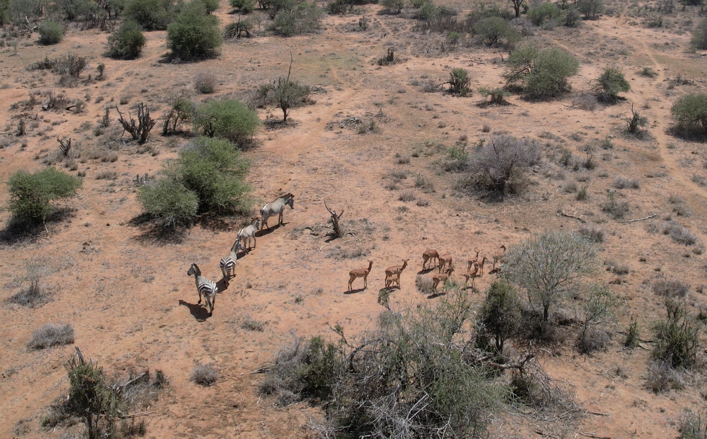

# Step 1: Video Data Collection with Drones

**Figure:** Clip of drone video containing Plains and Grevy's zebras, plus some impalas.

## Overview

The drone videos for the [KABR dataset](https://huggingface.co/datasets/imageomics/KABR) were collected at the Mpala Research Centre in January 2023. The missions were flown manually, using a DJI 2S Air drone.

## Best Practices

We collaborated with expert ecologists to ensure minimal disturbance to the animals. Our approach included:

- **Launch Position**: Approximately 200 meters horizontally from the animals.
- **Initial Altitude**: 30-40 meters above ground.
- **Approach Strategy**: Gradually approach the herd from the side by reducing altitude and horizontal distance.
- **Monitoring**: Continuously monitor animals for signs of vigilance.

!!! warning "Species-Specific Considerations"
    The vigilance exhibited by wildlife varies widely by species, habitat, sex, and the level to which animals may be habituated to anthropogenic noise. We recommend that you tailor your approach to your particular species and setting.

## Equipment Used

- **Drone**: DJI Air 2S.
- **Flight Mode**: Manual control.
- **Recording Settings**: Standard video recording at highest available resolution.

## Data Collection Workflow

1. **Site Assessment**: Scout the area and identify animal locations.
2. **Equipment Setup**: Prepare drone and check battery levels.
3. **Launch**: Deploy drone at safe distance from animals.
4. **Approach**: Gradually move closer while monitoring animal behavior.
5. **Recording**: Capture video footage of natural behaviors.
6. **Data Management**: Safely store and backup all collected footage.

## Publications

For detailed information on our data collection methodology, please refer to:

- [KABR: In-Situ Dataset for Kenyan Animal Behavior Recognition from Drone Videos](https://openaccess.thecvf.com/content/WACV2024W/CV4Smalls/papers/Kholiavchenko_KABR_In-Situ_Dataset_for_Kenyan_Animal_Behavior_Recognition_From_Drone_WACVW_2024_paper.pdf)
- [A Framework for Autonomic Computing for In Situ Imageomics](https://ieeexplore.ieee.org/abstract/document/10336017)
- [Integrating Biological Data into Autonomous Remote Sensing Systems for In Situ Imageomics](https://arxiv.org/abs/2407.16864)

## Next Steps

Once you have collected your drone video footage, proceed to [Step 2: Data Pre-processing](preprocessing.md) to create mini-scenes from your videos.