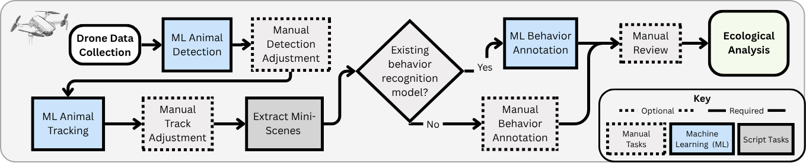

# Pipeline Overview

**Figure:** KABR tools pipeline for processing drone videos. The pipeline consists of four main steps: video data collection, data pre-processing, behavior labeling, and ecological analysis. Each step is modular and can be adapted to different species and study systems.

## Pipeline Steps

The KABR tools pipeline consists of four main sequential steps:

### 1. [Video Data Collection](data-collection.md)
Collection of drone video footage following best practices for wildlife observation while minimizing disturbance to animals.

### 2. [Data Pre-processing with CVAT](preprocessing.md)  
Creation of mini-scenes focused on individual animals using detection and tracking, either manual or automated approaches.

### 3. [Behavior Labeling](behavior-labeling.md)
Application of machine learning models to classify animal behaviors from the processed mini-scenes.

### 4. [Ecological Analysis](analysis.md)
Generation of ecological insights including time budgets, behavioral transitions, social interactions, and spatial analysis.

## Key Features

- **Modular Design**: Each step can be adapted and customized for different species and study systems.
- **Multiple Detection Options**: Support for both manual annotation and automated YOLO-based detection.
- **Machine Learning Integration**: Pre-trained models available with support for custom model training.
- **Comprehensive Analytics**: Generate multiple types of ecological metrics and visualizations.

## Getting Started

Follow the pipeline steps in order:

1. [Data Collection](data-collection.md)
2. [Pre-processing](preprocessing.md)  
3. [Behavior Labeling](behavior-labeling.md)
4. [Analysis](analysis.md)

Pre-processed [example data](https://huggingface.co/datasets/imageomics/kabr-worked-examples) for each step and [pre-trained models](https://huggingface.co/imageomics/x3d-kabr-kinetics) are available on Hugging Face to help you get started quickly.

For additional customization and advanced features, see [Optional Steps](optional-steps.md).