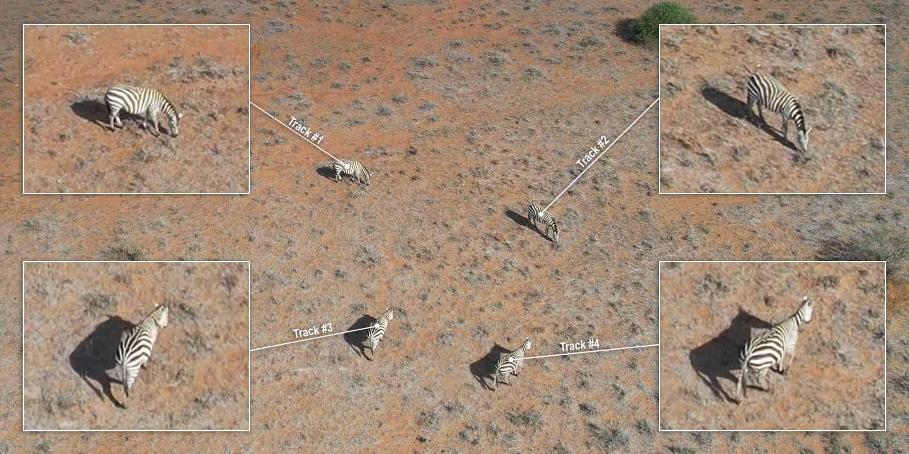
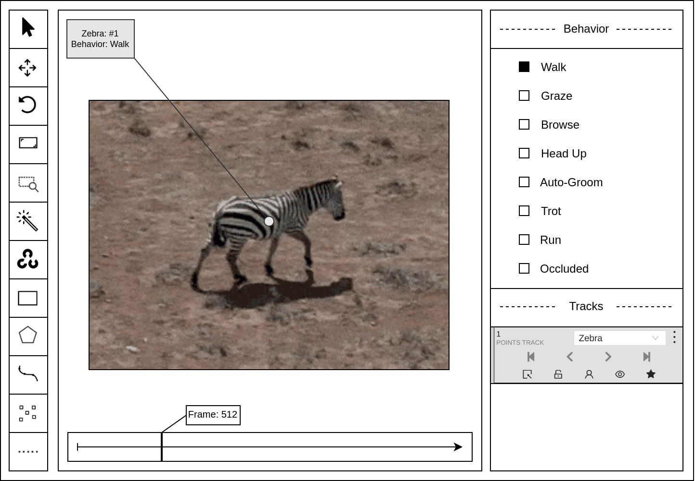

# Step 2: Data Pre-processing with CVAT

## Overview

In order to automatically label the animal videos with behavior, we must first create *mini-scenes* of each individual animal captured in the frame, as illustrated below.



**Figure:** A mini-scene is a sub-image cropped from the drone video footage centered on and surrounding a single animal. Mini-scenes simulate the camera as well-aligned with each animal in the frame, compensating for the drone's movement by focusing on just the animal and its immediate surroundings. The KABR dataset consists of mini-scenes and their frame-by-frame behavior annotation.

## Resources

- See the Wiki [CVAT User Guide](https://github.com/Imageomics/kabr-tools/wiki/CVAT-User-Guide) and [Data Management Tips](https://github.com/Imageomics/kabr-tools/wiki/Data-Management-Tips) for detailed instructions and recommendations.
- View example mini-scenes at [data/mini_scenes](https://huggingface.co/imageomics/x3d-kabr-kinetics/tree/main/data/mini_scenes) on Hugging Face.

## Step 2A: Perform Detections to Create Tracks

To create mini-scenes, we first must perform the detection step by drawing bounding boxes around each animal in frame.

### Option 1: Manual Detections in CVAT



**Figure:** Simplified CVAT annotation tool interface

Upload your raw videos to [CVAT](https://www.cvat.ai/) and perform the detections by drawing bounding boxes manually. This can be quite time consuming, but has the advantage of generating highly accurate tracks.

!!! note "Video Size Considerations"
    Depending on the resolution of your raw video, you may encounter out of space issues with CVAT. You can use [helper_scripts/downgrade.sh](../../helper_scripts/downgrade.sh) to reduce the size of your videos.

### Option 2: Automatic Detections with YOLO

You may use [YOLO](https://docs.ultralytics.com/) to automatically perform detection on your videos. Use the script below to convert YOLO detections to CVAT format.

**detector2cvat:** Detect objects with Ultralytics YOLO detections, apply SORT tracking and convert tracks to CVAT format.

```bash
detector2cvat --video path_to_videos --save path_to_save [--imshow]
```

## Step 2B: Create Mini-scenes from Tracks

Once you have your tracks generated, use them to create mini-scenes from your raw footage.

**tracks_extractor:** Extract mini-scenes from CVAT tracks.

```bash
tracks_extractor --video path_to_videos --annotation path_to_annotations [--tracking] [--imshow]
```

## Tool Reference

### detector2cvat

[Source: src/kabr_tools/detector2cvat.py](../../src/kabr_tools/detector2cvat.py)

Detect objects with Ultralytics YOLO detections, apply SORT tracking and convert tracks to CVAT format.

**Usage:**
```bash
detector2cvat --video path_to_videos --save path_to_save [--imshow]
```

### tracks_extractor  

[Source: src/kabr_tools/tracks_extractor.py](../../src/kabr_tools/tracks_extractor.py)

Extract mini-scenes from CVAT tracks.

**Usage:**
```bash
tracks_extractor --video path_to_videos --annotation path_to_annotations [--tracking] [--imshow]
```

## Next Steps

Once you have created your mini-scenes, proceed to [Step 3: Behavior Labeling](behavior-labeling.md) to classify behaviors using machine learning models.