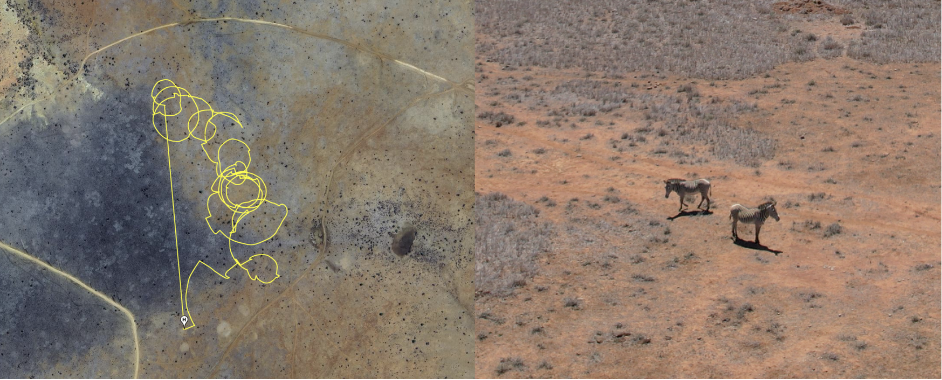
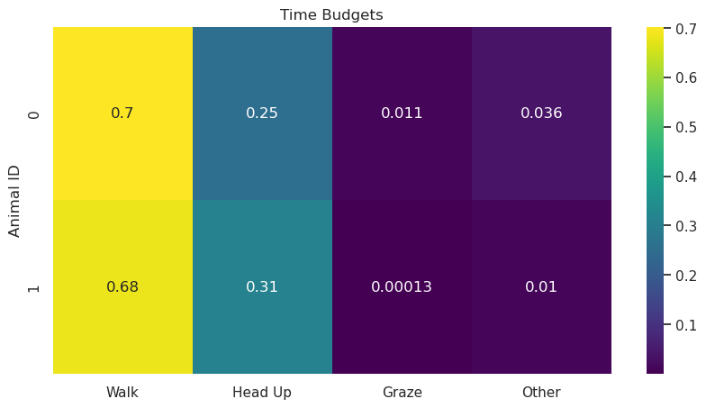
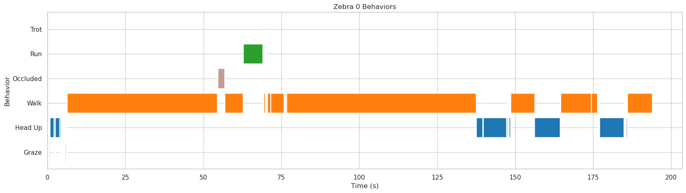

# Worked Example for Grevy's Zebras Time-Budget Analysis

This session includes two male Grevy's zebras travelling across an open plain on the 18th of January, 2023, between 12:45 and 13:00.


**Figure 1:** Flight path (left) tracking 2 male Grevy's zebras observed on 01/18/23. Video clip (right) from KABR dataset.

## Step 1: Download raw videos from session 7 on the 18th of January, 2023

You can download the raw videos directly from the [KABR Raw Videos dataset](https://huggingface.co/datasets/imageomics/KABR-raw-videos/tree/main/18_01_2023_session_7).

The videos files are: \
18_01_18_DJI_0068_trimmed \
18_01_18_DJI_0069 \
18_01_18_DJI_0070 \
18_01_18_DJI_0071 


```bash
mkdir -p grevystimebudget/raw_videos

cd grevystimebudget/raw_videos

wget https://huggingface.co/datasets/imageomics/KABR-raw-videos/blob/main/18_01_2023_session_7/DJI_0068_trimmed.mp4

wget https://huggingface.co/datasets/imageomics/KABR-raw-videos/blob/main/18_01_2023_session_7/DJI_0069.mp4

wget https://huggingface.co/datasets/imageomics/KABR-raw-videos/blob/main/18_01_2023_session_7/DJI_0070.mp4

wget https://huggingface.co/datasets/imageomics/KABR-raw-videos/blob/main/18_01_2023_session_7/DJI_0071.mp4

cd ../..
```

## Step 2: Extract mini-scenes from raw videos using `tracks_extractor`

You can download the CVAT annotations for these from the [KABR Worked Examples dataset](https://huggingface.co/datasets/imageomics/kabr-worked-examples/tree/main/detections).

The annotations files are:

18_01_2023_session_7-DJI_0068.xml \
18_01_2023_session_7-DJI_0069.xml \
18_01_2023_session_7-DJI_0070.xml \
18_01_2023_session_7-DJI_0071.xml \

```bash
mkdir -p grevystimebudget/annotations

cd grevystimebudget/annotations

wget https://huggingface.co/datasets/imageomics/kabr-worked-examples/blob/main/detections/18_01_2023_session_7-DJI_0068.xml

wget https://huggingface.co/datasets/imageomics/kabr-worked-examples/blob/main/detections/18_01_2023_session_7-DJI_0069.xml

wget https://huggingface.co/datasets/imageomics/kabr-worked-examples/blob/main/detections/18_01_2023_session_7-DJI_0070.xml

wget https://huggingface.co/datasets/imageomics/kabr-worked-examples/blob/main/detections/18_01_2023_session_7-DJI_0071.xml
cd ../..
```

Now you can use the `tracks_extractor` tool to extract mini-scenes from the raw videos using the CVAT annotations.

```bash
mkdir -p grevystimebudget/miniscenes
tracks_extractor --video grevystimebudget/raw_videos --annotation grevystimebudget/annotations --imshow --tracking
```
This will create a folder called `miniscenes` in the `grevystimebudget` directory with the extracted mini-scenes.
The `--imshow` flag will display the mini-scenes as they are being extracted, and the `--tracking` flag will enable tracking of individuals across frames.
This process may take a while depending on the number of videos and annotations.
```
# Example output:
Processing video: grevystimebudget/raw_videos/18_01_18_DJI_0068.mp4
Extracted 150 mini-scenes from 18_01_18_DJI_0068.mp4
```

See mini-scenes extracted for this session here: [grevystimebudget/miniscenes](https://huggingface.co/imageomics/x3d-kabr-kinetics/tree/main/data/mini_scenes)


## Step 3: Label mini-scenes with behavior using `miniscene2behavior`

You can use the `x3d_kabr_kinetics` tool to classify behaviors in the extracted mini-scenes.

Download model weights from [Hugging Face](https://huggingface.co/imageomics/x3d-kabr-kinetics).


```bash
mkdir -p grevystimebudget/classified_behaviors

miniscene2behavior --hub imageomics/x3d-kabr-kinetics --checkpoint x3d_kabr_kinetics.pyth --miniscene grevystimebudget/miniscenes/ --output grevystimebudget/mini_scene_behavior_annotations/DJI_0068_annotations.csv
```
This will classify the behaviors in the mini-scenes and save the results in a CSV file called `DJI_0068_annotations.csv` in the `/mini_scene_behavior_annotations` directory.

See behavior classifications extracted for this session here: [grevystimebudget/mini_scene_behavior_annotations](https://huggingface.co/imageomics/x3d-kabr-kinetics/tree/main/data/mini_scene_behavior_annotations)

## Step 4: Perform Ecological Analysis

We can analyze the behavior annotations labeled in Step 3 to create time budgets for the individuals observed in this session.

See the [time budgets notebook](/notebooks/time_budget.ipynb) for the code to create the visualizations.

Key step: convert the behavior labels generated by the miniscene2behavior to labels using the ethogram used in the field observations.

```bash
label2number = {
    "Walk": 0,
    "Graze": 1,
    "Browse": 2,
    "Head Up": 3,
    "Auto-Groom": 4,
    "Trot": 5,
    "Run": 6,
    "Occluded": 7}
```



**Figure 2:** Overall time budget for duration of 10 minute observation

<br>



**Figure 3:** Gantt chart for each zebra generated from time budget data (3 minute duration)
